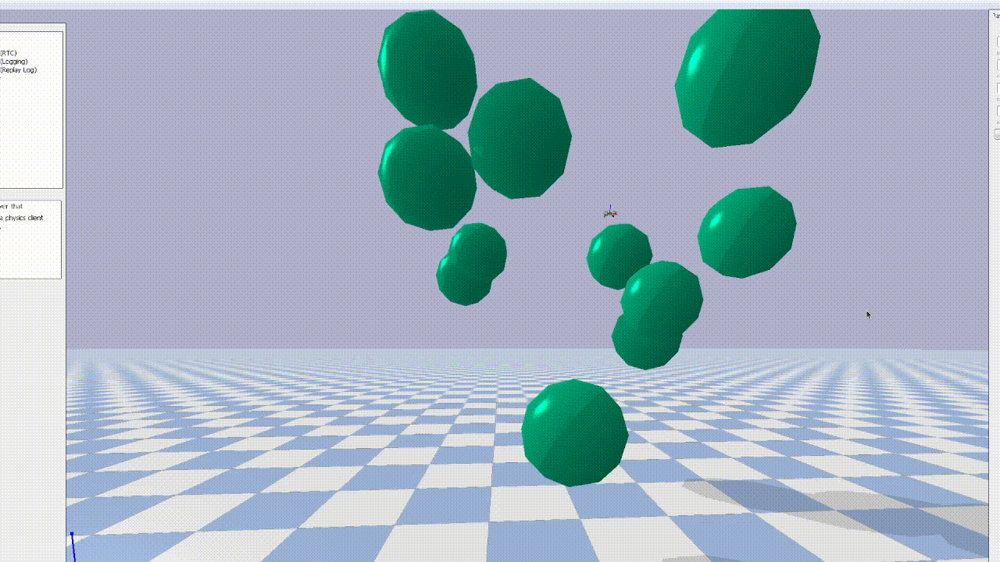

# RO47005-Project


| Student Name     | Student Number     |
|--------------|--------------|
| Antreas Kourris | 6284213 |
| Jonah Eggenkemper | 6286933 |
| Manas Reddy Ramidi	 | 6191258​ |
| Mukil Saravanan | 6195474​ |

This repository hosts the files used for our groups final project for RO47005 Path Planning and Decision Making


# Docker Instructions

See "./project_assets/docker/README_docker.md"

New packages and code goes into: ro47005_drone_simulator


# Installation of the Environment

## Using the RO47003 Singularity Container

Follow the instructions from the chapters 1 and 3 from this [manual](https://brightspace.tudelft.nl/d2l/le/content/682423/viewContent/4004834/View). Please download [this](https://surfdrive.surf.nl/files/index.php/s/PeR3mwCCXVv0xRT) singularity imgae instead the one linked in the manual.

After that, run these commands to install the [pybullet-drone-simulator](https://github.com/utiasDSL/gym-pybullet-drones) from wihtin the singularity terminal:

```
git clone https://github.com/utiasDSL/gym-pybullet-drones.git
cd gym-pybullet-drones/

pip3 install -e . # if needed, `sudo apt install build-essential` to install `gcc` and build `pybullet`
```

To check the installation, run: 

```
cd gym_pybullet_drones/examples/
python3 pid.py # position and velocity reference
python3 pid_velocity.py # desired velocity reference
```

Download the project worspace by running:

```
git clone git@github.com:AntreasK24/RO47005-Project.git
cd drone_ws
colcon build
source /opt/ros/humble/setup.bash
source install/setup.bash
```

Check the workspace by running `ros2 run drone_simulator drone_simulator`.


## Running the scenarios

After the workspace has been built with 

```
colcon build
```

The two different scenarios can be run by using the followig commands:

In order to start the first scenario 

```
 ros2 launch drone_mpc_python  launch_random_demo.py
```

This will launch the scenario where the drone will receive random target positions in a 3D world with randomly spawing spherical objects. The drone will navigate to the target positions using an MPC while avoiding the obstacles



In order to launch the second scenario run the following command

```
ros2 launch scenario_creator scenario_launch.py  
```

This scenario features a building. Inside the building the drone must navigate to random positions while avoiding collision with the pillars.


## Explanation of packages

This repository relies mainly on 4 package a brief description of each package follows below.

### drone_mpc_python

This package houses the model predictive control implementation including the drone dynamics, solver and ROS2 wrapper. There are several ROS2 parameters that control the behaviour of the solver and drone.

| Parameter Name    | Brief Description     |
|--------------|--------------|
| Q | State weights |
| R  | Input Weights  |
|  initial_state 	 | Initial state of drone |
|  target_pos | Initial target state |
|  accel_max | Upper and lower bound for acceleration constraint |
|  N_horizon | Prediction Horizon for MPC |
|  prediction_period | Prediction Period for MPC |
|  drone_radius | Estimation of the drone's radius |
|  d_min | Spherical obstacle diameter |
|  noise | Include noise in the drone states |
|  noise_std_vel | Standard deviation for velocity noise |


### drone_simulator

Simulates the environment for the first scenario

### scenario_creator

Creates the more complex scenario needed for the second scenario

### Trajectory generator 

Creates waypoints for the drone to follow. The following trajectories are avaible

| Trajectory Name    |
|--------------|
|Circular|
|Lemniscate|
|Linear|
|Spiral|
|Zigzag|
|Random|